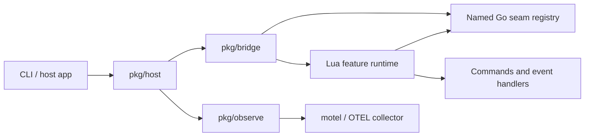

# extensible-go

A small Go + Lua host-kernel demo for applications that need user-owned runtime
extensibility without moving the durable core out of Go.

The project proves one shape: Go owns lifecycle, concurrency, validation, and
product seams; Lua feature packs customise named surfaces through a stable
control layer.

## Status

This is a public prototype, not a stable framework release. The interfaces are
small on purpose and may change while the core ideas settle.

The current demo is strong enough to show:

- Named Go seams that Lua can inspect, wrap, or replace.
- Transactional reloads where failed Lua keeps the previous runtime active.
- Validation that runs against isolated staged state and does not mutate the
  live app.
- Structured diagnostics and slog/OpenTelemetry reporting across Go -> Lua
  boundaries.
- A pure-Go debug path with Lua disabled.

## Quick start

```bash
mise run check
go build -o extensible-go .
./extensible-go
```

Try the interactive commands:

```text
slots
commands
check harmless
check dangerous
run hello Ben
run check delete-all
emit input dangerous
validate
reload
quit
```

Debug the Go defaults without loading Lua:

```bash
./extensible-go -no-lua
```

Enable human-readable structured logs:

```bash
./extensible-go -debug-log
```

## Why this exists

Large Go applications often need extension points, but exposing internals
creates fragile plugin APIs. This demo keeps the public seam small. Go registers
named product-level interfaces such as `core.policy`; Lua feature packs can then
wrap or replace those interfaces without knowing the Go implementation details.

That model is intended for larger agent or second-brain systems where users may
want to customise seams such as:

- `agent.context_builder`
- `agent.tool_policy`
- `agent.model_router`
- `memory.ranker`
- `memory.writer`

Lua is the control layer. Go remains the durable execution layer.

## Architecture



The bridge owns loading, validation, reload, and registry operations. The host
owns product surfaces such as policy checks, commands, events, logs, and CLI
reporting.

## Lua surface

Lua gets two globals.

### `registry`

Use this to take over named Go core seams:

```lua
registry:get("core.policy")
registry:set("core.policy", impl)
registry:wrap("core.policy", function(existing) return wrapped end)
registry:list()
```

### `app`

Use this to add user-facing features:

```lua
app:register_command("hello", {
    description = "Say hello",
    handler = function(args, ctx)
        ctx.print("hello", args)
    end
})

app:on("input", function(event, ctx)
    ctx.print("saw input", event.text)
end)
```

Handlers receive `ctx`:

```lua
ctx.print(...)
ctx.check(action)       -- call current core.policy
ctx.emit(event, text)   -- emit another event
```

## Go seam example

`pkg/host` exposes one representative core seam:

```go
type Policy interface {
    Check(action string) Decision
}
```

Lua can wrap it:

```lua
registry:wrap("core.policy", function(existing)
    return {
        Check = function(self, action)
            if action == "dangerous" then
                return { allow = false, reason = "blocked by Lua" }
            end
            return existing:Check(action)
        end
    }
end)
```

## Reload and validation

`ValidateDir` executes feature code against an isolated Lua VM, isolated
registry, and staged app state. It does not mutate live commands, events, or
registry entries.

`Reload` uses the same staged runtime and swaps it live only after every Lua file
loads successfully. Failed reloads keep the previous runtime active.

Bound slots are strict. Setting or wrapping an unknown slot, or replacing a known
slot with an invalid value, fails validation or reload instead of panicking later.

## Diagnostics and recoverability

Lua failures are product-level errors, not process crashes in the normal host
paths.

The current failure model is:

- Startup and reload failures return structured diagnostic errors and keep the
  previous runtime, or the pure Go defaults, intact.
- Command failures return `command_failed` diagnostics that include source,
  command name, operation, message, and the Lua traceback in the wrapped error.
- Event handler failures return `event_failed` diagnostics with event context.
- Policy failures deny by default and put the Lua error in the decision reason,
  which keeps the Go caller on a safe path.
- Missing methods, unknown slots, and invalid replacement values fail fast with
  stable diagnostic codes.

Applications can use `errors.As(err, *diagnostic.Error)` to inspect codes
programmatically. Diagnostics also expose `Fields()` for slog-compatible
structured reporting.

## Structured logging and OpenTelemetry

`host.App.SetLogger` makes logging an explicit product surface. By default logs
are discarded, `-debug-log` emits text logs, and `-otel` routes slog records to
OpenTelemetry through `pkg/observe`.

The demo records spans for the important Go -> Lua boundaries:

- `bridge.reload`
- `bridge.validate`
- `lua.runtime.build`
- `lua.load_file`
- `lua.registry.wrap`
- `host.check_policy`
- `lua.call`
- `host.run_command`
- `lua.command`
- `host.emit_event`
- `lua.event_handler`

## Motel validation

Motel was used as the local evidence loop for this demo. With `-otel` enabled,
the app exports JSON OTLP traces and slog records to motel, and the motel query
API verifies that the Go -> Lua boundaries appear as spans.

```bash
motel start
./extensible-go -otel -service extensible-go <<'EOF'
check dangerous
run hello Ben
emit input dangerous
reload
quit
EOF

curl 'http://127.0.0.1:27686/api/services'
curl 'http://127.0.0.1:27686/api/traces/search?service=extensible-go&limit=5'
```

If you use the TUI, switch to the `extensible-go` service with `[` or `]`, then
press `r` to refresh and `enter` to drill into a trace.

## Development workflow

This repo uses local `mise`, `golangci-lint`, and `hk` wiring copied from the
`data-refinery` workflow:

```bash
mise run go:fmt       # apply gofumpt/goimports via golangci-lint fmt
mise run go:lint      # run the configured linter set
mise run check        # fmt, lint, vet, smoke, tests, race, hk/mise validation
mise run hk:install   # optional: install git hooks
```

Run extension-shape benchmarks with:

```bash
./bench.sh
```

See [BENCHMARKS.md](BENCHMARKS.md) for benchmark groups and comparison guidance.

## Security model

Lua feature packs are trusted local code. This project is not a sandbox. Do not
load untrusted Lua files and expect OS-level isolation, resource limits, or data
exfiltration protection.

The safety boundary here is an application boundary: Lua can only take over
registered seams, and bad feature packs should fail validation or reload without
corrupting live app state. If you need to run untrusted extensions, put the Lua
runtime behind a process, container, or VM boundary.

## Licence

MIT. See [LICENSE](LICENSE).
